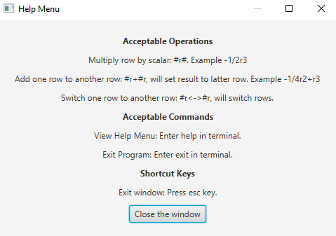
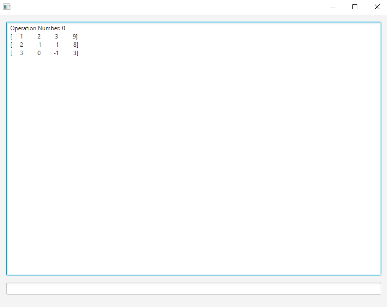
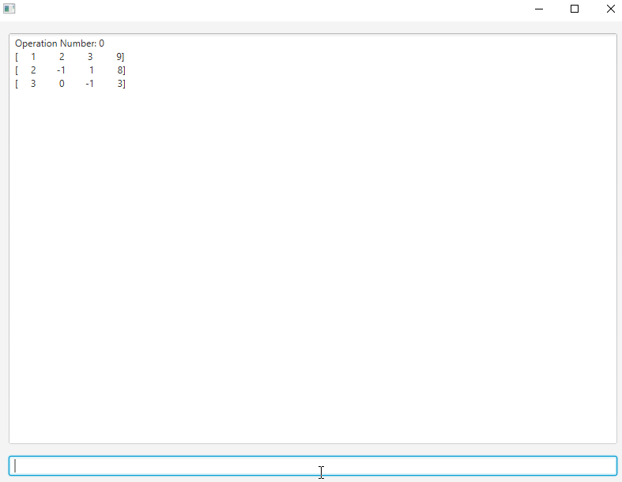
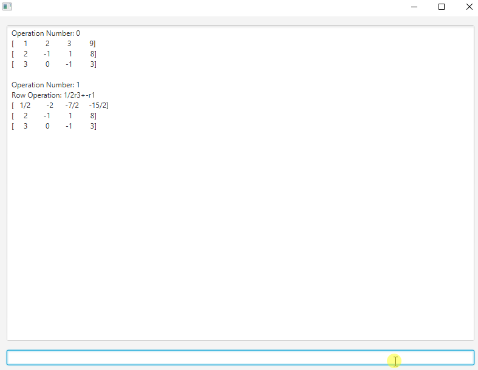
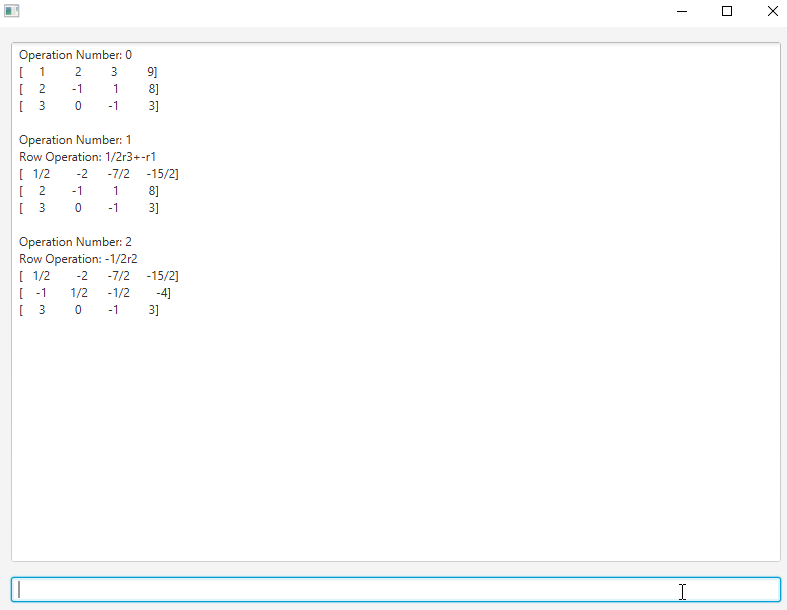
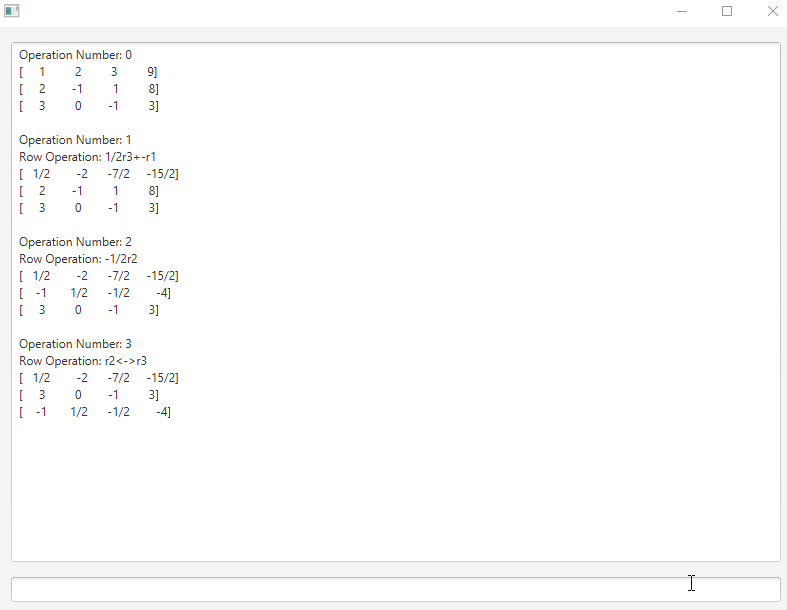
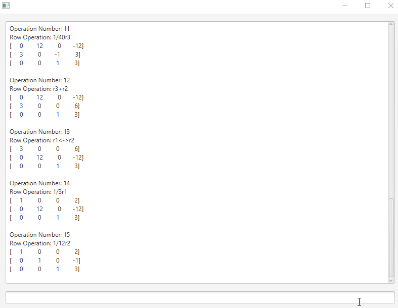

__Manual RREF__ is a simple Java GUI program used to manually make row operations on a N x N matrix via a input file. It is a good tool to practice reducing a matrix to row reduced echelon form without worrying about making any arithmetic mistakes, as I had done during my Linear Algebra course too many times...

A wrapper fraction class was made to show the user, along with keeping precious values of each operation. Fractions can be used with any of the acceptable operations. 

In order to use, have a text file titled "matrix.txt" that contains the size of the matrix on the first line (row column), with the following lines containing each rows contents

```
3 4
1 2 3 9
2 -1 1 8
3 0 -1 3
```

Once the jar is running, you'll be prompted with the "help" alert box telling the possible actions of the application.


After exiting the menu, you'll have the default matrix displayed to do row operations on.


**To add two rows**, specify the row you want to be added to the other. Scaling operations can be applied when doing so, but the only changes that will permanently be applied is to the resulting row result. (r1+r2 -> r2, 1/2r1+-3/2r3 -> r3)


**To scale a row**, specify the scalar value and the respective row with no spaces.



**To swap rows**, specify to two rows with a double arrow in between both rows. (r2<->r3)



**When errors occur**, you'll be greeted with a error alertbox attempting to specify what error occurred.



**To reopen the glossary / help menu**, type in "help" into the input bar.


### Additions for future

- [ ] Allowing user to specify alternative file.

- [ ] Handle scenario where input file contains incorrect content layout, and be able to allow user to edit file and attempt again, or specify alternative file, without closing application. 

- [ ] Allow user to export matrix operations to text file before exiting out of application. (Currently users can do this easily by manually copying the TextArea and pasting into a text file)
